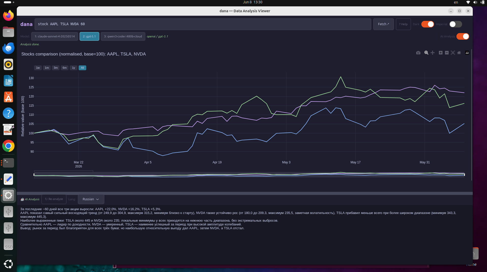
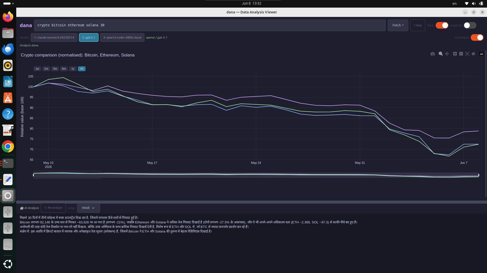
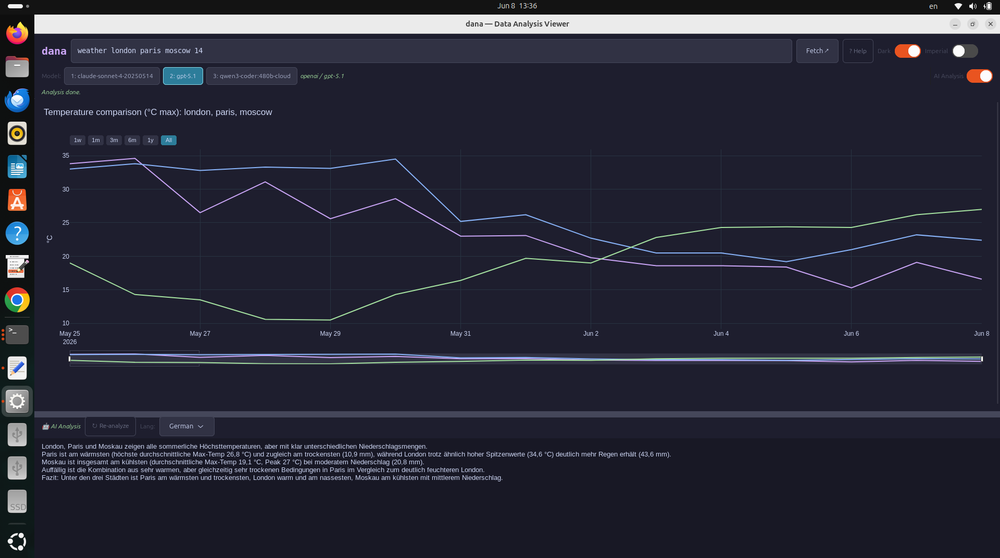
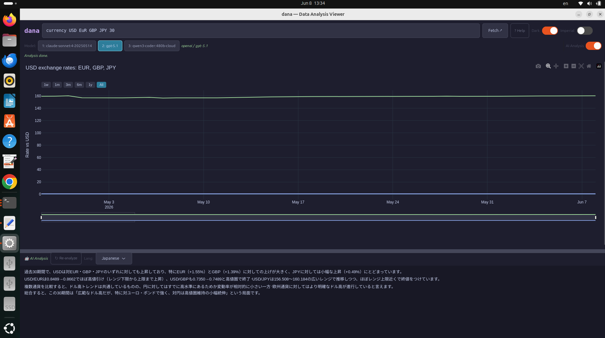
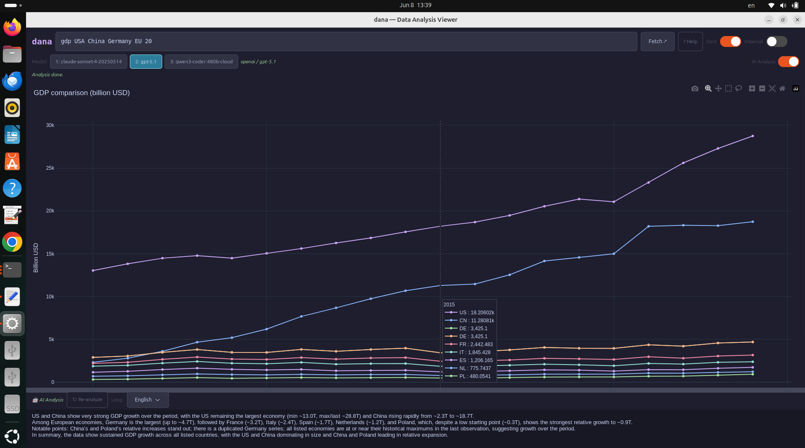
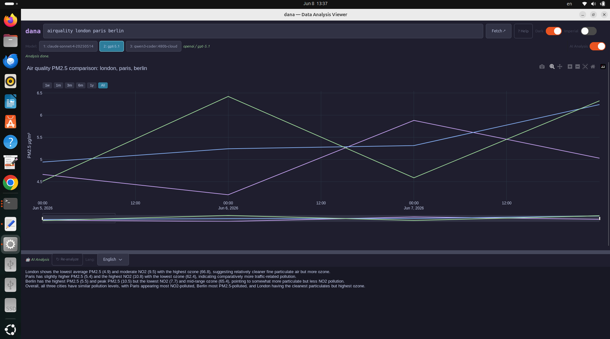
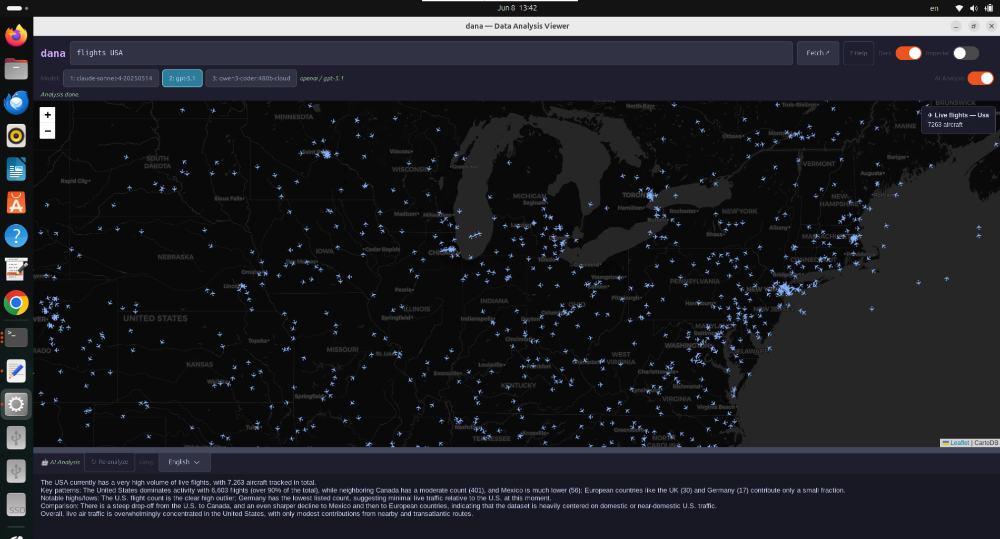
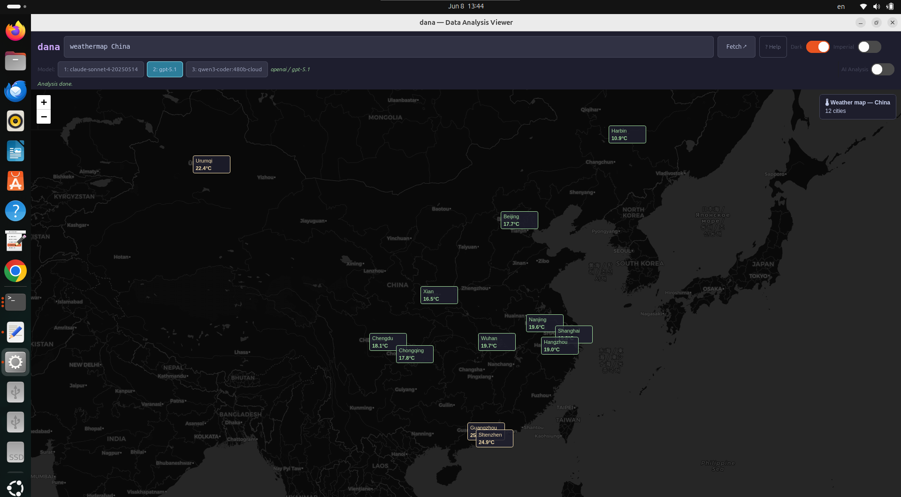
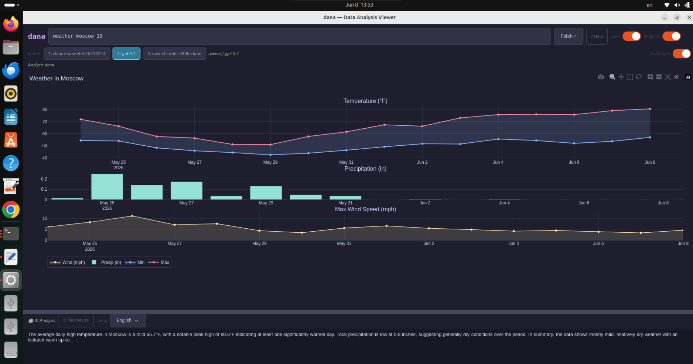

# dana — Data Analysis Viewer

**dana** is a free, open-source desktop data analysis terminal for Linux.  
Fetch financial, weather, economic and environmental data — visualize it instantly, analyze it with AI.



---

## Features

- **8 data types** — stocks, crypto, currencies, weather, air quality, GDP, live flights, weather maps
- **Multi-series comparison** — compare multiple tickers, cities or currencies on one chart
- **AI Analysis** — automatic analysis via [mshell](https://www.appservgrid.com/paw92) IPC, 15 languages
- **Dark/Light theme**, **Metric/Imperial** units toggle
- **Resizable panels** — drag the divider between chart and analysis
- **No API keys required** — all data sources are free and open

---

## Screenshots

| | |
|---|---|
|  |  |
| Stocks comparison (normalised) | Crypto comparison |
|  |  |
| Weather comparison | Currency exchange rates |
|  |  |
| GDP comparison | Air quality — multi-city |
|  |  |
| Live flights map | Weather map |
|  |  |
| Built-in help & quick reference | Imperial units mode |

---

## Built with


- **C** — GTK4 UI, WebKitWebView, mshell IPC client
- **Python** — data fetching, Plotly chart generation (`dana_worker.py`)
- **Bash** — install script

---

## Requirements

- Ubuntu 22.04 / 24.04 / 26.04 (x86_64)
- Debian 13 Trixie (x86_64)
- GTK4 + WebKitGTK 6.0
- Python 3.10+
- Internet connection (for data APIs)

**AI Analysis** additionally requires [mshell](https://www.appservgrid.com/paw92) running with `MSHELL_IPC_PID` set.

---

## Installation

```bash
git clone https://github.com/igor101964/dana
cd dana
chmod +x install.sh
./install.sh
```

The script installs all dependencies, builds and installs dana automatically.

### Manual build

```bash
sudo apt-get install build-essential libgtk-4-dev libwebkitgtk-6.0-dev libsoup-3.0-dev
pip3 install plotly yfinance requests pandas numpy
make && make install
```

---

## Usage

Run dana from a terminal (preferably inside a mshell session for AI Analysis):

```bash
dana &
```

Type a command in the input field and press **Enter** or **Fetch**.

---

## Commands

| Command | Syntax | Range | Examples |
|---|---|---|---|
| `stock` | `stock TICKER [days]` | 1–3650 days | `stock AAPL 30` · `stock AAPL TSLA NVDA 60` |
| `crypto` | `crypto COIN [days]` | 1–365 days | `crypto bitcoin 30` · `crypto bitcoin ethereum solana 30` |
| `currency` | `currency BASE TARGET [days]` | 1–3650 days | `currency USD EUR 30` · `currency USD EUR GBP JPY 30` |
| `weather` | `weather CITY [days]` | 1–92 days | `weather London 14` · `weather London Paris Moscow 14` |
| `airquality` | `airquality CITY` | last 3 days | `airquality London` · `airquality London Paris Berlin` |
| `gdp` | `gdp COUNTRY... [years]` | 1–60 years | `gdp USA China 20` · `gdp USA China Germany EU 20` |
| `flights` | `flights REGION` | live | `flights Europe` · `flights USA` · `flights World` |
| `weathermap` | `weathermap REGION` | current | `weathermap Europe` · `weathermap Japan` |

**Multi-series:** add multiple names separated by spaces for comparison charts.

**GDP aliases:** `EU` / `Europe` expands to Germany, France, Italy, Spain, Netherlands, Poland.

**Regions:** Europe · USA · Asia · Japan · China · Russia · MiddleEast · Africa · LatAm · Australia · World

### Keyboard shortcuts

| Key | Action |
|---|---|
| `Enter` | Fetch |
| `F1` | Help |

---

## AI Analysis

Enable the **AI Analysis** toggle in the top-right corner.  
After each fetch, dana automatically sends the data to the selected model via mshell IPC and displays the analysis below the chart.

- Select language from the **Lang** dropdown (15 languages)
- Click **Re-analyze** to repeat with current data
- Switch models using the **1 / 2 / 3** buttons
- Context memory is cleared automatically after each analysis

Requires mshell running in the same terminal session with `MSHELL_IPC_PID` set.

---

## Data Sources

| Source | Data | License |
|---|---|---|
| [Open-Meteo](https://open-meteo.com) | Weather, Air Quality | MIT / Free |
| [CoinGecko](https://coingecko.com) | Crypto prices | Free tier |
| [OpenSky Network](https://opensky-network.org) | Live flights | Research/Non-commercial |
| [World Bank](https://data.worldbank.org) | GDP | CC BY 4.0 |
| [Yahoo Finance](https://finance.yahoo.com) via yfinance | Stocks, Currency | Personal use |

All sources are free, no API keys required.

---

## License

MIT License — see [LICENSE](LICENSE)

Copyright (c) 2026 igor101964
